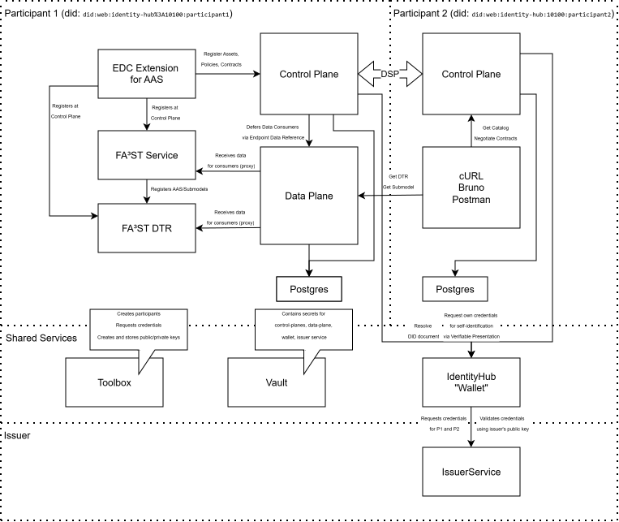

# Hercules Sample Environment

Hercules is an MX-Port variant from the [Factory-X Project](https://github.com/factory-x-contributions), showcasing the complete MX-Port implementation on the provider side. This sample environment demonstrates a functional data space with a full-stack MX-Port provider service (Control Plane, Data Plane, Extension with FA³ST integration) alongside essential infrastructure components and a consumer control plane for cross-participant data exchange.

## Overview - Components at a Glance

The Hercules sample implements an end-to-end MX-Port data space with the MX-Port Provider service stack and supporting infrastructure. Each component belongs to a specific ecosystem and serves a distinct purpose.

### Control Plane (Participant 1) - MX-Port Provider
**Flavor**: [Factory-X EDC Control Plane](https://github.com/factory-x-contributions/edccontrolplane)  
**Purpose**: Primary EDC connector for the MX-Port provider managing assets, policies, and negotiations. Offers DSP (Dataspaces Protocol) endpoints for catalog discovery, contract negotiation, and data exchange. Works with the Data Plane for secure data transfer and with the Identity Hub for participant authentication and credential-based access policies. The Control Plane acts as the central coordinating component for the provider's data offering.

### Data Plane - MX-Port Provider
**Flavor**: [Factory-X EDC Data Plane](https://github.com/factory-x-contributions/edcdataplane)  
**Purpose**: Secure data transfer endpoint using signature-based access tokens for the MX-Port provider. When a consumer wants to access data (e.g., from the FA³ST AAS service), the Data Plane validates the access token and serves the data based on the policy granted during contract negotiation. It integrates with the Control Plane to receive token validation instructions and uses keys stored in Vault for token signing/verification.

### Extension (Standalone) - MX-Port Provider AAS Integration
**Flavor**: Custom EDC Extension for AAS (Catenax AAS Integration)  
**Purpose**: EDC Extension for AAS that integrates FA³ST service for digital twin management; performs automated AAS registration. Automatically registers all Submodel Repositories with the EDC Control Plane and registers FA³ST AAS at the Digital Twin Registry (DTR). No additional configuration needed beyond the extension configuration. This enables traceability in the data space by making each Submodel a separate data set that can be independently negotiated and transferred.

### Identity Hub (Wallet)
**Flavor**: [Tractus-X Identity Hub](https://github.com/eclipse-tractusx/wallet)  
**Purpose**: DID-based identity management for all participants in the data space, commonly referred to as "Wallet". Provides three key services: (1) DID service where participants can look up and verify what services other participants offer, (2) Credential service where verifiable credentials can be acquired from an issuer and forwarded to participant components like their connector, and (3) Secure Token Service (STS) that generates bearer tokens containing the participant's credentials. The Identity Hub is essential for participant discovery and credential-based authorization in the data space. Currently shared by both participants but could in theory be deployed per-participant.

### Issuer Service
**Flavor**: [Construct-X Wallet Issuer Service](https://github.com/project-construct-x/wallet)  
**Purpose**: Verifiable credential issuer (MembershipCredentials) for the MX-Port data space. Issues signed credentials that participants can use to prove their membership and access rights within the data space. Note: The publicly available issuer services by Eclipse EDC and Eclipse TractusX do not yet support the required credential issuance functionality for this demo. To use this example, you need to build and run the Construct-X Wallet fork which contains the necessary functionality. The Issuer Service is currently shared by both participants but could in theory be deployed per-participant.

### FA³ST Registry (DTR)
**Flavor**: [Fraunhofer FA³ST Registry](https://github.com/FraunhoferIOSB/FAAAST-Registry)  
**Purpose**: Digital Twin Registry (DTR) as defined by [Catena-X standard CX-0002](https://catenax-ev.github.io/docs/standards/CX-0002-DigitalTwinsInCatenaX#122-digital-twin-registry). Stores AAS (Asset Administration Shell) shell descriptors for all digital twins in the data space. separate from EDC's asset management/catalog - it follows the Catena-X digital twin specification. The Extension (Standalone) registers FA³ST AAS services with this registry to enable participant discovery.

### Consumer Control Plane (Participant 2)
**Flavor**: [Factory-X EDC Control Plane](https://github.com/factory-x-contributions/edccontrolplane)  
**Purpose**: EDC connector acting as a consumer participant for testing cross-participant data exchange. Demonstrates how an external participant can discover assets from the MX-Port provider, negotiate access, and transfer data using the EDC protocol. Uses a dedicated PostgreSQL database (`postgres2`) separate from the provider's infrastructure.

### PostgreSQL
**Flavor**: [PostgreSQL 16](https://www.postgresql.org/)  
**Purpose**: Shared database for all services. Provides persistent storage for the EDC Control Plane (Participant 1), Data Plane, Identity Hub, Issuer Service, and Postgres2 (for Participant 2). Hosts multiple databases (`edc`, `identity_hub`, `issuer_service`, `participant2`) to separate data for different participants and services.

### HashiCorp Vault
**Flavor**: [HashiCorp Vault](https://www.vaultproject.io/)  
**Purpose**: Secrets management service for credentials and cryptographic keys. Stores database credentials, API keys, STS client secrets, and data plane public/private key pairs. Provides a secure centralized store that all EDC services use to retrieve their secrets. Currently shared by both participants but could in theory be deployed per-participant.

### Toolbox
**Flavor**: Debian-based utility container (custom)  
**Purpose**: Utility container with tools for debugging and initialization (`curl`, `jq`, `vim`, `iputils-ping`). Used to run initialization scripts that onboard participants and issue credentials. Provides a shell environment for testing API calls and interacting with services during development and troubleshooting.

## API Access

Services expose the following ports for external access via `localhost`:

| Service | Port | Description |
|---------|------|-------------|
| Control Plane (Participant 1) | `18081` | Management API (via docker-compose port mapping) |
| Control Plane (Participant 2) | `8081` | Management API |
| Data Plane | `9500` | Public data endpoint (`/public`) |
| Identity Hub | `10100` | DID endpoint |
| Identity Hub | `15151` | Identity API |
| FA³ST Registry (DTR) | `8090` | Shell Descriptors (uncomment in docker-compose to enable) |
| Vault | `8200` | HashiCorp Vault API |

## Architecture




**Note**: All services communicate via Docker's internal DNS on the default network.
- Services may be exposed to external host for demonstration (e.g., vault) or debug.
- Every EDC service is debuggable, expose port 5005 and use remote debugging in your IDE
- Internal communication uses container hostnames (e.g., `http://control-plane:8081`)

## Prerequisites

- [Docker](https://docs.docker.com/get-docker/)
- [Docker Compose](https://docs.docker.com/compose/install/)
- [Bruno](https://www.usebruno.com/) (optional, for API testing)
- [Bruno CLI](https://www.usebruno.com/docs/cli/installation) (optional, for running tests from command line)

## Quick Start

1. **Copy environment file** (optional, defaults will be used):
   ```bash
   cd samples/hercules
   cp .env.example .env
   ```

2. **Build the standalone extension** (if modified):
   ```bash
   cd samples/hercules/standalone-hercules
   ./gradlew shadowJar
   cd ../..
   docker compose build standalone
   ```

3. **Start all services**:
   ```bash
   docker compose up -d
   ```

4. **Initialize participants and credentials** (in correct order):
   ```bash
   # Wait for services to be healthy (takes ~30-60 seconds)
   docker compose ps
   
   # Initialize issuer first
   docker compose exec toolbox ./init_issuer.sh
   
   # Then initialize participants
   docker compose exec toolbox ./init_participant.sh
   ```

4. **Access services**:
   - Control Plane Management (P1): `http://localhost:18081/management`
   - Control Plane Management (P2): `http://localhost:8081/management`
   - Data Plane: `http://localhost:9500/public`
   - Identity Hub: `http://localhost:10100`
   - Identity Hub API: `http://localhost:15151`
   - FA³ST Registry: `http://localhost:8090/shell-descriptors` (uncomment in docker-compose to enable)
   - PostgreSQL: `localhost:5432`
   - Vault: `http://localhost:8200`

## API Testing

The bruno collections in `docs/bruno/` enable complete testing of the MX-Port data space, including contract negotiation and data transfer flows as specified in the [Hercules architecture decision records](./docs/adr/).

### Test Flows

| Collection | Tests | Purpose |
|------------|-------|---------|
| `docs/bruno/discovery/` | Catalog, Negotiation, EDR, Data | EDC discovery protocol (find, negotiate, get EDR, access data) |
| `docs/bruno/data-access/` | Catalog, Negotiation, Transfer, Data | End-to-end data transfer using EDC extension |
| `docs/bruno/other/` | Identity Hub, DID, Credentials | Identity and credential services |

### Automated AAS Registration

The EDC Extension for AAS performs **automatic registration** of AAS components:
- Submodel Repository at the EDC Control Plane
- FA³ST AAS service at the FA³ST Digital Twin Registry (DTR)

No manual registration steps are required - the extension handles these automatically on startup.

### Running Tests from Host

```bash
# Install Bruno CLI (optional)
npm install -g @usebruno/cli

# Run discovery protocol tests (catalog, negotiation, EDR)
cd samples/hercules
bruno run docs/bruno/discovery

# Run data access tests (end-to-end transfer)
bruno run docs/bruno/data-access
```

## Service Details

### Control Plane (Participant 1) - MX-Port Provider
- **Image**: `ghcr.io/factory-x-contributions/edc-controlplane-postgresql-hashicorp-vault`
- **Ports**:
  - `18081`: Management API (`/management`)
  - `8084`: DSP Protocol (`/api/v1/dsp`)
  - `8085`: Catalog API (`/catalog`)
- **Purpose**: MX-Port provider's EDC connector managing assets, policies, and negotiations
- **Participant ID**: `did:web:wallet%3A10100:participant1`

### Extension (Standalone) - MX-Port Provider AAS Integration
- **Image**: `standalone-hercules:latest` (custom build)
- **Ports**:
  - `8080`: FA³ST Service
  - `8181`: EDC Extension API (internal)
  - `5005`: Debug port
- **Purpose**: MX-Port provider extension integrating FA³ST AAS service with EDC for digital twin management
- **Configuration**: `config/edc/extension/configuration.properties`
- **Network Access**: Connects to `control-plane`, `dtr`, `data-plane`, `wallet`, `issuer-service`, and `vault` via Docker network
- **Automated AAS Registration**: Automatically registers Submodel Repository and FA³ST AAS at EDC Control Plane and DTR on startup
- **Participant**: Uses `participant1` identity (`did:web:wallet%3A10100:participant1`)

### Data Plane - MX-Port Provider
- **Image**: `ghcr.io/factory-x-contributions/edc-dataplane-hashicorp-vault`
- **Ports**:
  - `9500`: Public data endpoint (`/public`)
- **Purpose**: Secure data transfer endpoint using signature-based access tokens for the MX-Port provider
- **Keys**: Generated and stored in HashiCorp Vault during initialization
- **Network Access**: Connects to `control-plane` and `vault` via Docker network; accessed by `standalone` for data transfer
- **Participant**: Uses `participant1` identity

### Identity Hub
- **Image**: `tractusx/identityhub:v0.3.2`
- **Ports**:
  - `7171`: Well-known API
  - `13131`: Credentials API
  - `10100`: DID endpoint
  - `15151`: Identity API
  - `9292`: STS (Security Token Service)
- **Purpose**: DID-based identity management for participants
- **Configuration**: `config/edc/identityhub/participant1.properties`

### Issuer Service
- **Image**: `ghcr.io/factory-x-contributions/fx-id-hub-charts/issuerservice`
- **Ports**:
  - `9999`: Status List
  - `13132`: Issuance API
  - `15152`: Issuer Admin API
- **Purpose**: Issues verifiable credentials (MembershipCredentials)
- **Configuration**: `config/edc/issuerservice/configuration.properties`

### FA³ST Registry (DTR)
- **Image**: `fraunhoferiosb/faaast-registry:1.2.0-SNAPSHOT`
- **Ports**:
  - `8090`: Shell Descriptors endpoint
- **Purpose**: Digital Twin Registry storing AAS descriptions
- **Configuration**: `config/aas/dtr.properties`
- **Initial Model**: `config/aas/model.aasx`

### HashiCorp Vault
- **Image**: `hashicorp/vault`
- **Ports**:
  - `8200`: Vault API
- **Mode**: Dev mode (not for production)
- **Token**: Configured via `VAULT_TOKEN` in `.env`
- **Stores**:
  - Database credentials
  - API keys for control plane and extension
  - STS client secrets
  - Data plane public/private keys

### PostgreSQL
- **Image**: `postgres:16.4-alpine`
- **Ports**:
  - `5432`: PostgreSQL (exposed via docker-compose network)
- **Databases**: `edc`, `identity_hub`, `issuer_service`, `participant2`
- **Initialization**: `config/postgres/pg_init.sql`

### Toolbox
- **Image**: Custom `debian:bookworm-slim` (builds from `toolbox/`)
- **Purpose**: Utility container with tools for debugging and initialization
- **Includes**: `curl`, `jq`, `vim`, `iputils-ping`, `ca-certificates`

### Control Plane (Participant 2) - Consumer
- **Image**: `ghcr.io/factory-x-contributions/edc-controlplane-postgresql-hashicorp-vault`
- **Ports**:
  - `8081`: Management API (`/management`)
- **Purpose**: Consumer control plane for testing MX-Port cross-participant communication
- **Participant ID**: `did:web:wallet%3A10100:participant2`
- **Network Access**: Connects to `postgres2` and `vault` via Docker network; accessible from all other containers
- **Note**: No host ports exposed for protocol/catalog, accessed only from other containers (e.g., `curl http://participant2:8081/management`)
- **Configuration**: `config/edc/controlplane/participant2.properties`

## Directory Structure

```
samples/hercules/
├── .env.example                  # Environment variable template
├── docker-compose.yaml           # Main compose definition
├── bruno/                        # Bruno API test collections (deprecated - internal hostnames)
│   ├── opencollection.yml       # Shared collection config (deprecated)
│   ├── control-plane/           # Control plane API tests
│   ├── discovery/               # Discovery protocol tests
│   └── data-access/             # Data access tests
├── docs/bruno/                  # Bruno API test collections (recommended - localhost:PORT)
│   ├── opencollection.yml       # Shared collection config (recommended)
│   ├── control-plane/           # Control plane API tests
│   ├── discovery/               # Discovery protocol tests
│   ├── data-access/             # Data access tests
│   └── other/                   # Other service API tests
│   ├── control-plane/           # Control plane API tests
│   ├── discovery/               # Discovery protocol tests
│   └── data-access/             # Data access tests
├── config/                       # Configuration files
│   ├── aas/                     # FA³ST/AAS configuration
│   │   ├── model.aasx          # Default AAS model
│   │   ├── fa3st-config.json   # FA³ST service config
│   │   └── dtr.properties      # Digital Twin Registry config
│   ├── edc/                     # EDC connector configurations
│   │   ├── controlplane/       # Control plane configs
│   │   │   ├── participant1.properties
│   │   │   └── participant2.properties
│   │   ├── extension/          # AAS extension config
│   │   │   ├── configuration.properties
│   │   │   └── default_policy.json
│   │   ├── dataplane/          # Data plane config
│   │   │   └── configuration.properties
│   │   ├── identityhub/        # Identity hub config
│   │   │   └── participant1.properties
│   │   ├── issuerservice/      # Issuer service config
│   │   │   ├── configuration.properties
│   │   │   └── credentials/
│   │   │       └── membership.json
│   │   ├── logging.properties
│   │   ├── log4j2.xml
│   │   ├── opentelemetry.properties
│   │   └── vault/              # Vault initialization
│   ├── postgres/               # Database initialization
│   │   └── pg_init.sql
│   └── toolbox/                # Toolbox initialization
│       ├── data/               #Participant/issuer data
│       │   ├── participant1.json
│       │   ├── participant2.json
│       │   └── issuer.json
│       ├── templates/          #JSON templates for API calls
│       │   ├── participant.json
│       │   ├── holder.json
│       │   ├── attestation.json
│       │   ├── credential.json
│       │   └── credential_request.json
│       ├── init_participant.sh #Participant initialization script
│       └── init_issuer.sh      #Issuer initialization script
├── bruno/                      #Bruno API test collections (deprecated)
│   ├── opencollection.yml     #Shared collection config (internal hostnames)
│   ├── control-plane/         #Control plane API tests
│   ├── discovery/             #Discovery protocol tests
│   └── data-access/           #Data access tests
├── docs/bruno/                 #Bruno API test collections
│   ├── opencollection.yml     #Shared collection config (localhost:PORT)
│   ├── control-plane/         #Control plane API tests
│   ├── discovery/             #Discovery protocol tests
│   ├── data-access/           #Data access tests
│   └── other/                 #Other service API tests (wallet, etc.)
├── standalone-hercules/        # Standalone application
│   ├── build.gradle.kts        # Gradle build configuration
│   └── build/                  # Built JAR (generated)
└── toolbox/                    # Toolbox container definition
    ├── Dockerfile
    └── entrypoint.sh
```

## Network Architecture

### Docker Networking

Docker Compose creates a default bridge network named `<project_name>_default` (e.g., `hercules_default`). All services that don't specify a custom network are connected to this default network.

#### Internal Communication (Docker DNS)

Services communicate internally using their container names as hostnames:
- `http://control-plane:8081/management/v3`
- `http://data-plane:9500/public`
- `http://wallet:15151/api/identity`

All container names resolve automatically within the Docker network.

#### External Access (localhost:PORT)

Services expose specific ports on `localhost` for external access:

| Service | Port | Internal Path | External URL |
|---------|------|---------------|--------------|
| Control Plane 1 | `18081` | `/management` | `http://localhost:18081/management` |
| Control Plane 2 | `8081` | `/management` | `http://localhost:8081/management` |
| Data Plane | `9500` | `/public` | `http://localhost:9500/public` |
| Identity Hub | `10100` | `/` | `http://localhost:10100/` |
| Identity Hub API | `15151` | `/api/identity` | `http://localhost:15151/api/identity` |
| FA³ST Registry | `8090` | `/shell-descriptors` | `http://localhost:8090/shell-descriptors` |
| Vault | `8200` | `/v1/` | `http://localhost:8200/v1/` |

**Note**: Uncomment the port mappings in `docker-compose.yaml` to enable external access to services.

### Default Docker Network

All services in this environment are connected to the default network:

#### Network Topology

```
                    Docker Default Network (hercules_default)
                    ───────────────────────────────────────────
                    
    ┌─────────────┐    ┌─────────────┐    ┌─────────────┐    ┌─────────────┐
    │  control-   │    │  data-      │    │  identity-  │    │  issuer-    │
    │  plane      │────│  plane      │    │  hub        │    │  service    │
    │             │    │             │    │             │    │             │
    └─────────────┘    └─────────────┘    └─────────────┘    └─────────────┘
           │                  │                  │                  │
           │                  │                  │                  │
    ┌─────────────┐    ┌─────────────┐    ┌─────────────┐    ┌─────────────┐
    │  standalone │────│  dtr        │    │  vault      │    │  postgres   │
    │             │    │             │    │             │    │             │
    └─────────────┘    └─────────────┘    └─────────────┘    └─────────────┘
           │
           │
    ┌─────────────┐
    │  toolbox    │
    │             │
    └─────────────┘
           │
    ┌─────────────┐    ┌─────────────┐
    │  participant2│   │  postgres2  │
    └─────────────┘    └─────────────┘
```

### Service Hostname Resolution

| Service Name | Hostname | IP (Docker DNS) |
|-------------|----------|-----------------|
| control-plane | `control-plane` | 172.x.x.x |
| standalone | `standalone` | 172.x.x.x |
| data-plane | `data-plane` | 172.x.x.x |
| wallet | `wallet` | 172.x.x.x |
| issuer-service | `issuer-service` | 172.x.x.x |
| dtr | `dtr` | 172.x.x.x |
| participant2 | `participant2` | 172.x.x.x |
| toolbox | `toolbox` | 172.x.x.x |
| postgres | `postgres` | 172.x.x.x |
| postgres2 | `postgres2` | 172.x.x.x |
| vault | `vault` | 172.x.x.x |

### Key Network Connections

| Service | Connects To | Purpose |
|---------|-------------|---------|
| `standalone` | `control-plane:8081` | EDC management API |
| `standalone` | `data-plane:9500` | Data access via public endpoint |
| `standalone` | `dtr:8090` | FA³ST registry for AAS |
| `standalone` | `wallet:15151` | Identity management |
| `standalone` | `issuer-service:13132` | Credential issuance |
| `standalone` | `vault:8200` | Secrets management |
| `data-plane` | `control-plane:8083` | Dataplane selector |
| `data-plane` | `vault:8200` |Keys management |
| `participant2` | `postgres2:5432` | PostgreSQL database |
| `participant2` | `vault:8200` | Secrets management |
| All services | `wallet:13131` | Credentials API |
| All services | `issuer-service:15152` | Issuer admin API |

## Understanding the Workflow

### Initialization Flow

1. **Service Startup**: All services start via `docker-compose up`
   - Vault initializes first with secret keys
   - PostgreSQL creates databases
   - Services wait for dependencies (health checks)
   
2. **Network Resolution**: Services connect via Docker's internal DNS:
   - Hostnames like `control-plane`, `data-plane`, `wallet` resolve automatically
   - All services must be on the same Docker network (default bridge)

3. **Participant Initialization** (`init_participant.sh`):
   - Creates participant entries in Identity Hub
   - Requests MembershipCredentials from Issuer
   - Generates data plane key pairs
   - Stores secrets in HashiCorp Vault

3. **Issuer Initialization** (`init_issuer.sh`):
   - Registers issuer participant in Identity Hub
   - Creates attestation templates
   - Creates credential definitions

### Credential Flow

```
┌─────────────────────┐     ┌───────────────────┐     ┌──────────────────┐
│ MX-Port Provider    │────▶│  Identity Hub     │◀────│   Issuer         │
│   (Participant 1)   │     │                   │     │   Service        │
└─────────────────────┘     └───────────────────┘     └──────────────────┘
                               │                          │
                               │                          │
                               ▼                          ▼
                       ┌───────────────────┐     ┌──────────────────┐
                       │  STS Token         │     │ Attestation      │
                       │  Service           │     │ / Credentials    │
                       └───────────────────┘     └──────────────────┘
```

1. MX-Port Provider registers with Identity Hub
2. Issuer registers with Identity Hub
3. MX-Port Provider requests MembershipCredential from Issuer
4. Issuer verifies provider (via attestation)
5. Issuer issues signed credential
6. Credential stored in provider's Identity Hub

### Data Access Flow

```
┌──────────────────────────┐     ┌─────────────────┐     ┌──────────────┐
│ MX-Port Provider         │────▶│  Control Plane  │────▶│  Data Plane  │
│   (Participant 1)        │     │  (Provider)     │     │              │
└──────────────────────────┘     └─────────────────┘     └──────────────┘
                                                               │
                                                               │
                                                        ┌──────────────┐
                                                        │ Consumer     │
                                                        │ (P2)         │
                                                        └──────────────┘
```

1. Consumer (Participant 2) requests catalog from MX-Port Provider
2. Provider exposes FA³ST AAS data via Data Plane
3. Negotiation for asset access occurs via DSP protocol
4. Contract agreement established with MembershipCredential-based policy
5. Data plane token generated using provider's keys
6. Consumer accesses data via signed token at Data Plane

## Configuration

### Environment Variables (`.env`)

| Variable | Description | Default |
|----------|-------------|---------|
| `CONTROL_PLANE_API_KEY` | API key for control plane management | `password` |
| `EXTENSION_API_KEY` | API key for standalone extension | `password` |
| `IDENTITY_HUB_SUPERUSER_ID` | Identity Hub admin user | `admin` |
| `IDENTITY_HUB_SUPERUSER_KEY` | Identity Hub admin key | `YWRtaW4=.s3cr3t` |
| `ISSUER_SERVICE_SUPERUSER_ID` | Issuer service admin user | `admin` |
| `ISSUER_SERVICE_SUPERUSER_KEY` | Issuer service admin key | `YWRtaW4=.s3cr3t` |
| `POSTGRES_USER` | PostgreSQL username | `postgres` |
| `POSTGRES_PASSWORD` | PostgreSQL password | `password` |
| `VAULT_TOKEN` | HashiCorp Vault root token | `token` |
| `VAULT_PORT` | HashiCorp Vault port | `8200` |

### Participant Configuration

Each participant has a JSON configuration file (`config/toolbox/data/*.json`):
```json
{
  "apiKey": "YWRtaW4=.s3cr3t",
  "did": "did:web:wallet%3A10100:participant1",
  "contextId": "did:web:wallet%3A10100:participant1",
  "credentialsApi": "http://wallet:13131/api/credentials",
  "identityApi": "http://wallet:15151/api/identity",
  "stsClientSecretAlias": "participant1-sts-client-secret",
  "dataPlanePrivateKeyAlias": "private-key",
  "dataPlanePublicKeyAlias": "public-key"
}
```

### Key Configuration Files

- **Extension**: `config/edc/extension/configuration.properties`
  - Controls AAS/DTR integration
  - Sets access policies
  - Configures FA³ST service connection

- **FA³ST**: `config/aas/fa3st-config.json`
  - Configures AAS registry endpoints
  - Sets endpoint configurations
  - Defines persistence layer

##Bruno API Testing

Bruno collections are provided for testing APIs. The collections in `docs/bruno/` use `localhost:PORT` addresses, allowing you to test directly from your host machine.

### Using Bruno from Host Machine

1. **Install Bruno CLI** (optional):
   ```bash
   npm install -g @usebruno/cli
   ```

2. **Run tests from host**:
   ```bash
   cd samples/hercules
   bruno run docs/bruno/discovery/Get Catalog.yml
   ```

3. **Environment variables**:
   - Authentication: Uses `x-api-key: password` header (see `docs/bruno/opencollection.yml`)
   - Variables defined: `p1-management-api` (localhost:18081), `p2-management-api` (localhost:8081), `p1-data-plane-public` (localhost:9500)

### Available Collections

- `docs/bruno/control-plane/`: Policy and configuration queries
- `docs/bruno/discovery/`: EDC discovery protocol (catalog, negotiation, transfers)
- `docs/bruno/data-access/`: Data transfer operations
- `docs/bruno/other/`: Identity Hub and other service tests

### Bruno Collection Changes

The `docs/bruno/` collection uses:
- **Internal hostnames** (e.g., `control-plane:8081`) → for testing within Docker network
- **Localhost ports** (e.g., `localhost:18081`) → for testing from host machine

The `bruno/` directory contains older collections with internal hostnames (deprecated).

**Recommended**: Use `docs/bruno/` collection for host-based testing.

## Common Tasks

### viewing logs

```bash
docker compose logs -f
docker compose logs -f control-plane
docker compose logs -f Standalone
```

### Restarting a service

```bash
docker compose restart control-plane
docker compose restart standalone
```

### Stopping all services

```bash
docker compose down
# To remove volumes:
docker compose down -v
```

## Development

### Rebuild standalone extension

The standalone extension is built using Gradle:

```bash
cd samples/hercules/standalone-hercules
./gradlew shadowJar
# The JAR is created at: build/libs/standalone-hercules.jar
```

### Add new participant

1. Create participant configuration in `config/toolbox/data/`
2. Add to `init_participant.sh` initialization function
3. Restart and reinitialize toolbox container

### Modify AAS model

1. Edit `config/aas/model.aasx` (binary FA³ST model file)
2. Restart FA³ST service (standalone container)

## Troubleshooting

### vault health check failing

```bash
docker compose exec vault vault status
docker compose logs vault
```

### participant initialization failing

```bash
docker compose exec toolbox cat /scripts/data/issuer.json
docker compose exec toolbox curl -v http://wallet:15151/api/identity
docker compose exec toolbox curl -v http://data-plane:9500/public
docker compose exec toolbox curl -v http://participant2:8081/management
docker compose exec toolbox ping data-plane
```

### data access not working

```bash
# Check data plane registration
docker compose exec control-plane curl http://data-plane:9500/public
# Check vault keys
docker compose exec vault vault kv get secret/edc
```

### FA³ST not connecting

```bash
docker compose exec dtr curl http://localhost:8090/shell-descriptors
docker compose exec Standalone cat /resources/fa3st/config.json
docker compose exec Standalone curl http://dtr:8090/shell-descriptors
docker compose exec Standalone curl http://data-plane:9500/public
```

### Network connectivity issues

If services cannot reach each other:

```bash
# Check if toolbox can reach other services
docker compose exec toolbox ping control-plane
docker compose exec toolbox ping data-plane
docker compose exec toolbox ping participant2
docker compose exec toolbox curl -v http://wallet:15151/api/identity

# Verify services are on the same network
docker compose network inspect hercules_default

# Check service health
docker compose ps

# Restart services and rebuild networks
docker compose down
docker compose up -d
```

**Common causes**:
- Services not running (check `docker compose ps`)
- Service name typos in configuration
- Services starting before dependencies are healthy
- Docker network not properly created

## Security Notes

⚠️ **This is a sample environment, NOT production-ready:**

- HashiCorp Vault is running in dev mode with known token
- Database credentials are hardcoded in configuration
- API keys are simple passwords
- TLS/SSL is disabled for most services
- Self-signed certificates (if any) are not validated

For production deployment:
- Use production-grade Vault with proper secrets management
- Implement proper certificate chain with trusted CAs
- Use secure password generation and rotation
- Enable TLS for all services
- Implement network policies and firewall rules

## See Also

- [EDC Extension for AAS](../../README.md)
- [FA³ST Service](https://github.com/admin-shell-io/faaast-service)
- [Eclipse DITTO Connectors](https://github.com/eclipse-ditto/ditto-clients)
- [Tractus-X Identity Hub](https://github.com/eclipse-tractusx/wallet)
- [FA³ST Registry](https://github.com/FraunhoferIOSB/FAAAST-Registry)